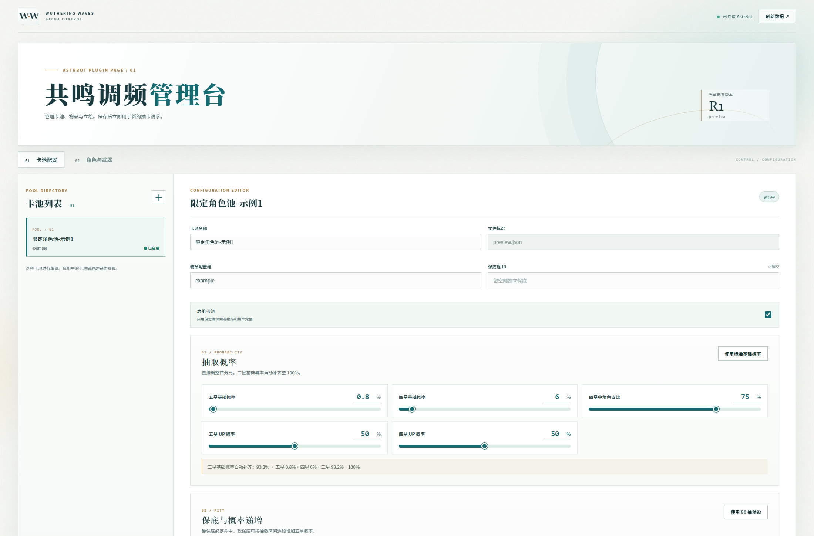
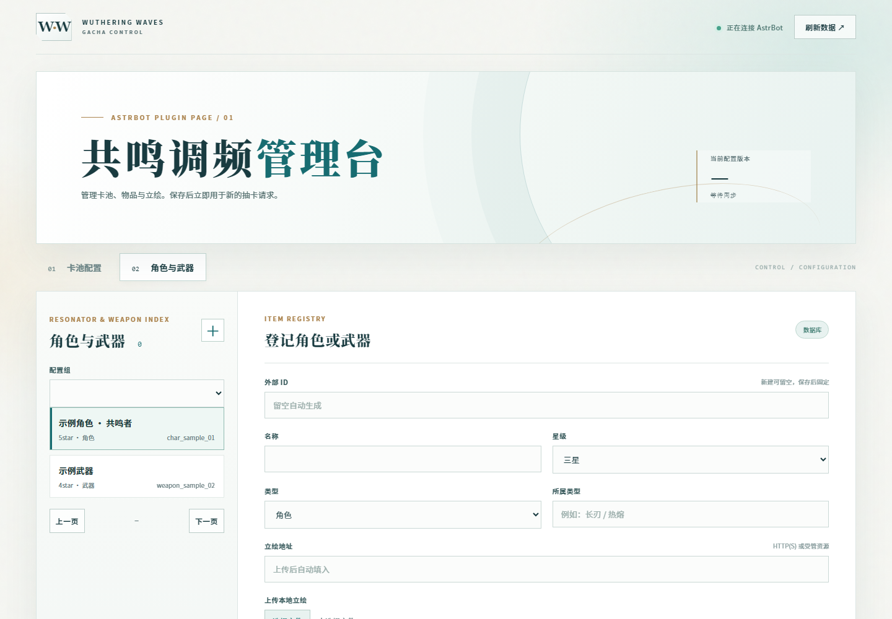
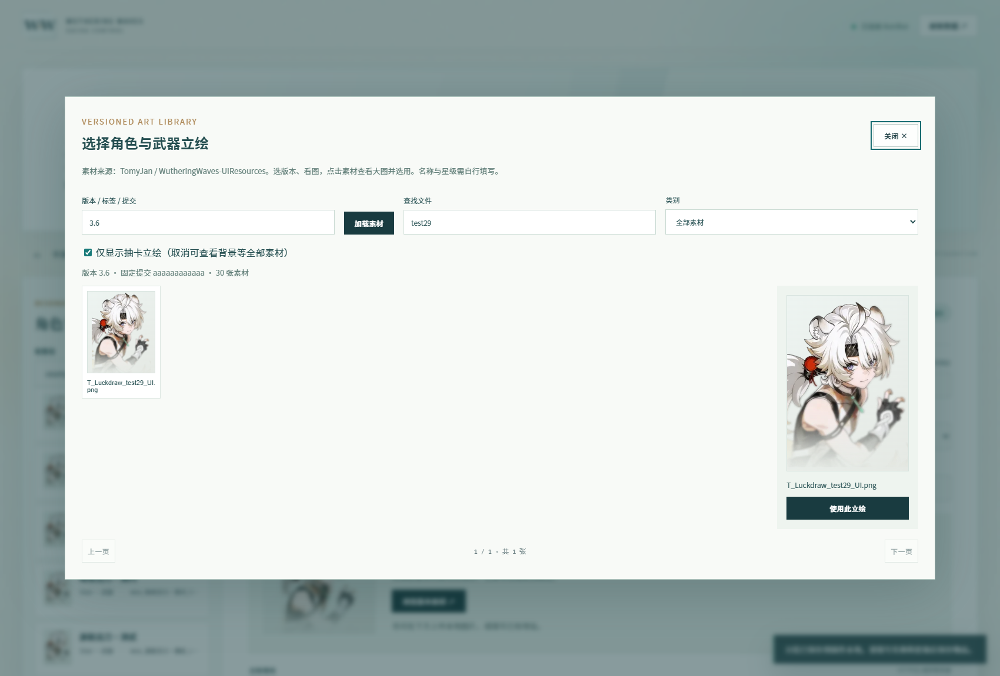

# AstrBot 鸣潮模拟抽卡

一个面向 AstrBot 的鸣潮抽卡模拟插件。它提供可配置卡池、保底与 UP 机制、图片结果、抽卡记录，以及由 AstrBot Plugin Pages 托管的管理页面。

当前版本：`v1.4.0`
运行要求：AstrBot `>=4.27.5`、Python `>=3.12`

## 功能

- 单抽、十连、卡池选择、保底状态和历史记录。
- 自定义卡池概率、软保底、硬保底、UP 保证和保底组。
- 抽卡结果、历史记录和卡池详情的图片渲染；首次缺少立绘时先发文字，再补发完整图片。
- AstrBot 原生管理页面：卡池、物品、配置组和立绘资源管理。
- 立绘素材支持远程地址、管理页面导入和压缩后的本地 WebP；兼容已有 PNG。
- 卡池立绘一键准备、进度与失败重试；离线资源 ZIP 导出、导入。
- 立绘首次下载支持 GitHub Raw、`cdn.jsdelivr.net` 和 `fastly.jsdelivr.net` 回退；普通用户无需配置系统代理。
- SQLite 持久化抽卡记录和保底状态，支持迁移备份、并发写入和旧身份认领。
- Windows、Linux 和 Python 3.12/3.14 测试覆盖。

## 安装

### AstrBot 仪表板安装

在 AstrBot 仪表板的插件安装页搜索 `astrbot_plugin_ww_gacha_sim`，或者填入仓库地址：

```text
https://github.com/HoshiKurea/astrbot_plugin_ww_gacha_sim
```

安装后重载插件。AstrBot 会处理宿主依赖，插件的直接依赖位于 `requirements.txt`。

通过 ZIP 升级已有安装时，宿主可能提示同名插件目录已存在。请先备份插件数据和配置，卸载旧插件时不要勾选“删除配置”和“删除数据”，再安装新 ZIP 并重载。升级后可用 `/wwg 帮助` 检查新入口。

### 手动安装

在 AstrBot 根目录执行：

```bash
git clone https://github.com/HoshiKurea/astrbot_plugin_ww_gacha_sim.git data/plugins/astrbot_plugin_ww_gacha_sim
```

升级现有安装时，先备份 `data/plugin_data/astrbot_plugin_ww_gacha_sim/`，再更新插件并重载。插件目录下应直接包含 `main.py`、`metadata.yaml`、`src/` 和 `pages/admin/`。

## 第一次使用

1. 在 AstrBot 控制台打开插件详情中的 `admin` 管理页面。
2. 在“物品”页面登记角色和武器；可以浏览版本素材，也可以上传本地 PNG、JPEG 或 WebP 立绘。
3. 在“卡池”页面新建或导入卡池，选择候选物品，校验后保存并启用。
4. 在聊天中发送 `/wwg 卡池`，按列表编号选择卡池，然后进行抽卡。

新卡池默认停用。启用前需要通过配置校验，并且三个星级都必须有候选物品。

## 指令

统一入口使用 `/wwg`（Wuthering Waves Gacha）指令组；旧入口 `/鸣潮` 和 `/ww抽卡` 作为兼容别名保留。

单独发送 `/wwg` 会显示 AstrBot 的指令组提示；完整使用帮助可通过 `/wwg 帮助` 或 `/wwg_help` 查看，原有 `/wgs_help` 仍然可用。下表使用默认唤醒前缀 `/`；如果宿主修改了前缀，请使用实际配置的前缀。

| 指令 | 用途 |
| --- | --- |
| `/wwg 帮助` | 查看完整帮助和兼容别名 |
| `/wwg 卡池` | 列出启用卡池、临时编号和卡池 ID |
| `/wwg 选择 <编号\|ID\|名称>` | 设置个人默认卡池 |
| `/wwg 单抽 [ID\|名称]` | 单次抽卡，省略参数使用默认卡池 |
| `/wwg 十连 [ID\|名称]` | 十连抽卡 |
| `/wwg 记录 [ID\|名称] [页码]` | 查看历史，每页 10 条 |
| `/wwg 保底 [ID\|名称]` | 查看五星、四星保底和 UP 保证状态 |
| `/卡池详细 <ID\|名称>` | 查看卡池状态、概率和候选数量 |
| `/重载卡池` | 管理员重新发布磁盘中的卡池配置 |
| `/wwg 诊断` | 管理员查看数据库、字体、缓存和渲染队列状态 |
| `/认领旧抽卡 <旧ID> <目标ID> [目标平台ID]` | 管理员迁移升级前的历史和保底 |

常用兼容别名包括 `/卡池`、`/唤取`、`/单抽`、`/十抽`、`/十连`、`/抽卡记录`、`/抽卡保底`、`/抽卡帮助`。实际名称以 AstrBot 指令管理页为准。

示例流程：

```text
/wwg 卡池
/wwg 选择 1
/wwg 十连
/wwg 保底
/wwg 记录
```

历史记录只填写一个数字时按页码处理，例如 `/wwg 记录 2`。指定卡池翻页时使用 `/wwg 记录 pool-id 2`。

## 立绘资源与离线使用

管理页面的版本素材浏览器读取 `TomyJan/WutheringWaves-UIResources` 的固定版本内容。首次下载依次尝试：

1. GitHub Raw 原地址；
2. `cdn.jsdelivr.net` 公共镜像；
3. `fastly.jsdelivr.net` 公共镜像。

下载器会记住可用的素材源，后续优先复用，减少重复等待失效源。镜像只用于内置素材仓库，普通用户不需要设置系统代理。管理员在物品页面点击“保存到插件本地”或上传图片后，文件会以压缩后的受管 WebP 保存在 `data/plugin_data/astrbot_plugin_ww_gacha_sim/portraits/`，物品地址会变为 `local:` 地址。之后抽卡渲染直接读取本地文件。已有 PNG 文件与地址继续兼容。

首次抽到尚未缓存的远程立绘时，插件先发送真实文字结果，再以默认 3 路并发下载所需图片；同一资源只下载一次，资源齐全后才补发完整图片。下载不占用渲染线程，也不计入默认 8 秒的纯图片渲染超时。

资源等待默认最多 45 秒，可在配置中调整。未能就绪时会保留文字结果并说明原因；超时的下载继续缓存供后续使用，不会重抽，也不会发送缺少立绘的半成品图片。网络完全不可用时，可以在管理页面上传本地立绘。

新立绘按最长边 1280 像素、质量 90 的透明 WebP 保存，远程缓存保留 30 天并受缓存容量上限约束。此压缩发生在下载后，不能减少上游原始 PNG 首次传输的字节数；它减少后续磁盘占用、图片解码与重复下载。安装包使用压缩背景和无损精灵图集，普通结果使用 JPEG，确有透明像素的结果保留 PNG。

### 提前准备卡池与离线资源包

打开管理页面的“资源与离线包”，选择卡池后点击“准备卡池资源”。插件只准备该卡池引用的不同立绘，相同地址共享下载；页面显示当前可用数、已离线保存数、进度及失败原因。可以停止准备或重试失败项，已经就绪的资源会复用。任务在后台运行，离开页面不影响准备；准备不会启用停用卡池，也不会产生抽卡记录。

资源齐全后点击“导出离线 ZIP”。在无法联网的 AstrBot 中打开相同页面，选择该 ZIP 导入即可。两端应使用相同的卡池和物品配置；资源包只传递立绘，不包含或修改卡池概率、用户历史与保底状态。

准备和离线导入的资源保存在插件数据目录的 `portraits/offline/`，长期保留，不受普通缓存 30 天有效期影响。物品地址无需修改；素材预览、保存到本地和抽卡都会优先使用已准备的资源。普通远程预览也共享 30 天的完整图片和缩略图缓存，避免预览后又重复下载。

单个离线包最多 64 MiB、500 张立绘，解压总量最多 256 MiB。导入会校验目录、格式、尺寸及校验和，整包验证通过后才保存素材。每个插件同时最多运行两个资源任务；图片后台处理和数据库任务另有容量限制，满载会提示繁忙。

## 配置

配置文件由 AstrBot 管理，位置为 `data/config/astrbot_plugin_ww_gacha_sim_config.json`。优先使用插件配置页；修改后需要重载插件。

| 配置项 | 默认值 | 说明 |
| --- | ---: | --- |
| `enable_rendering` | `true` | 是否发送抽卡图片 |
| `enable_history_recording` | `true` | 是否保存历史记录 |
| `default_pool_id` | `""` | 未选择卡池时使用的默认 ID |
| `save_rendered_results` | `false` | 是否保存压缩后的抽卡结果图片 |
| `cache_cleanup_interval` | `24` | 资源缓存清理间隔，单位为小时 |
| `cache_max_mb` | `512` | 缓存容量上限，单位为 MiB |
| `rendered_result_retention_days` | `7` | 已保存结果图片的保留天数 |
| `font_path` | `""` | 自定义中文字体绝对路径，留空自动查找 |
| `render_workers` | `2` | 并发图片渲染数 |
| `render_queue_limit` | `20` | 等待渲染队列上限 |
| `render_timeout_seconds` | `8` | 仅计算图片绘制与编码的等待时间 |
| `portrait_download_workers` | `3` | 立绘并发下载数，范围 1–6 |
| `portrait_wait_timeout_seconds` | `45` | 先发文字后等待完整立绘的秒数，范围 5–120 |
| `database_queue_limit` | `64` | 抽卡与管理操作的后台等待队列上限，范围 0–256 |
| `enable_proxy` | `false` | 是否为远程资源启用插件代理 |
| `proxy_url` | `""` | 代理地址，例如 `http://127.0.0.1:7890` |

抽卡数据、卡池配置、备份和本地立绘均位于 `data/plugin_data/astrbot_plugin_ww_gacha_sim/`。升级前请备份整个目录。关闭历史记录不会关闭保底状态保存。

## 管理页面

页面由 AstrBot Plugin Pages 托管，不再启动独立 WebUI，也不需要额外端口或密码。管理 API 复用 AstrBot 的插件鉴权。

- 卡池保存采用版本号，两个管理页面同时编辑时会拒绝过期提交。
- 删除物品前会检查卡池引用；被引用物品不能删除或直接修改星级、类型。
- 立绘上传会校验格式、文件大小和像素数，并缩放、重新编码为受管 WebP。
- 管理页数据库与文件操作在后台队列执行；卡池及物品写入与抽卡事务串行处理，聊天读取已发布的配置快照。
- 请求取消不会提前释放仍在工作的任务容量；排队期间卡池被停用或配置变化时，抽卡会在提交前拒绝该旧请求。
- 卡池配置直接保存后即可供后续抽卡使用；手动修改磁盘 JSON 后请发送 `/重载卡池`。

### 页面截图

以下截图来自原生管理页面的实际操作流程：







## 开发与验证

安装开发依赖：

```bash
python -m pip install -r requirements-dev.txt
```

运行 Python 测试和静态检查：

```bash
python -m compileall -q main.py src
python -m ruff check main.py src tests
python -m pytest -q
```

安装真实 AstrBot 的环境还需要验证消息管线，避免只直接调用处理函数而遗漏指令匹配和聊天插件干扰：

```bash
python tests/runtime_commands.py
python tests/runtime_smoke.py
python tests/runtime_resources.py
```

`ASTRBOT_SOURCE_ROOT` 可指定宿主源码目录。运行检查均使用临时数据；消息管线检查覆盖回复发送、事件终止、指令别名、参数、管理员权限、唤醒前缀和插件禁用范围。资源检查使用真实宿主 Web 请求、文件响应和上传接口，验证共享下载、离线包导入、缓存清空后的离线预览及十连渲染。

构建管理页面需要 Node.js 20 或更高版本：

```bash
cd webui
npm ci
npm run check
npm run build
```

构建产物位于 `pages/admin/`，发布插件时需要和 `webui/` 源码一起保留。

## 数据迁移与问题排查

- 首次升级会在插件数据目录生成 SQLite 和卡池配置备份；迁移失败时插件不会继续写入抽卡数据。
- 旧版本没有平台实例信息的记录不会自动绑定到新用户，管理员需要使用 `/认领旧抽卡` 明确指定归属。
- 图片生成失败不会重抽，插件会返回已经提交的文字结果。
- 立绘加载失败时，先在管理页面保存为本地文件；若必须使用远程 URL，再检查插件代理或网络连接。
- `/wwg 诊断` 可用于查看数据库可写性、字体、缓存和渲染队列。

### 指令被当作普通对话

1. 检查插件列表中的加载状态和日志，确认当前加载的是 `v1.4.0`，并看到“鸣潮模拟抽卡插件已初始化”。安装 ZIP 后需要重载插件；加载失败时指令不会注册。
2. 在**发生问题的平台或会话对应的配置文件**中检查 `wake_prefix`。使用 `/wwg 帮助` 时，应保留 `/`，并把它排在空字符串前面，例如 `["/", ""]`。`[""]` 或 `["", "/"]` 会保留消息中的 `/`，导致标准指令匹配失败；如果只配置 `!`，应发送 `!wwg 帮助`。
3. 检查该配置的插件启用范围 `plugin_set`，以及会话级插件开关，确认包含 `astrbot_plugin_ww_gacha_sim`。插件全局已启用不代表每个配置和会话都已启用。
4. 在 AstrBot 的指令管理页确认 `wwg` 指令组与 `wgs_help`（含 `wwg_help` 别名）已启用，且没有被重命名。先测试 `/wwg 帮助` 和 `/wwg_help`，再测试 `/wwg 卡池`；旧入口 `/鸣潮 帮助` 和 `/ww抽卡 帮助` 仍然可用。
5. 如果已返回插件回复，却还出现其他聊天插件的回复，升级到 `v1.2.1` 或更高版本。插件会在发送回复后终止传播，防止低优先级监听器继续处理；更早执行并主动拦截事件的其他插件仍需按其配置排查。

唤醒前缀由 AstrBot 统一处理，优先级只决定已匹配处理器的执行顺序。插件不会擅自修改宿主前缀、启用范围或指令开关。相关规则见 [AstrBot 官方指令说明](https://docs.astrbot.app/use/command.html)。

## 许可证

本项目使用 [AGPL-3.0](LICENSE)。
